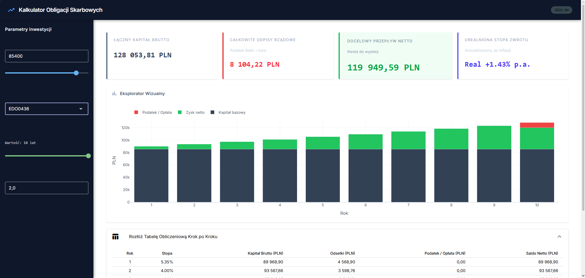

# 📈 FBO Kalkulator Obligacji MVP 
### Od specyfikacji do wdrożenia – Prototyp kalkulatora obligacji skarbowych

Działający prototyp Minimum Viable Product (MVP) zaprojektowany, aby dostarczyć rzetelnych i precyzyjnych wyliczeń zysków z polskich detalicznych obligacji skarbowych. Projekt udowadnia podejście produktowe: od rygorystycznej analizy matematycznej, przez architekturę bezstanową, aż po reaktywny interfejs użytkownika.

---



---

## 🚀 Kluczowe Funkcjonalności (Core Logic)

Silnik obliczeniowy precyzyjnie odwzorowuje mechanizmy finansowe zdefiniowane w listach emisyjnych Ministerstwa Finansów:

* **Obsługa wielu instrumentów**: Pełna logika dla obligacji **TOS** (3-letnie stałoprocentowe),
**COI** (4-letnie indeksowane) oraz **EDO** (10-letnie emerytalne).
* **Mechanizm Kapitalizacji**: Implementacja procentu składanego dla EDO/TOS oraz corocznej wypłaty odsetek dla COI.
* **Pancerz Antydeflacyjny**: Automatyczna bariera zerująca podstawę oprocentowania w scenariuszu ujemnej inflacji ($r_{t} = \max(0, i_{t}) + m$).
* **Tarcza Podatkowa (Wcześniejszy Wykup)**: Unikalny algorytm pomniejszający podstawę opodatkowania o opłatę karną, co optymalizuje zysk netto inwestora przy zerwaniu lokaty.
* **Zgodność z Ordynacją Podatkową**: Zaokrąglenia wszelkich kwot (zysków i podatków) do pełnych groszy według standardu `ROUND_HALF_UP`.

---

## 🏗️ Architektura Techniczna

Aplikacja została zbudowana w doktrynie **"Product First"**, minimalizując dług technologiczny:

* **Backend & Frontend**: Python + **NiceGUI** (reaktywny UI oparty na Vue3 i WebSockets).
* **Data Management**: Mocked API w formacie JSON (`bonds_data.json`), co pozwala na aktualizację oferty bez ingerencji w kod źródłowy.
* **Wizualizacja**: Interaktywne wykresy Waterfall (dla strumieni pieniężnych) oraz Stacked Bar (dla narastającego kapitału) przy użyciu biblioteki Plotly.
* **Konteneryzacja**: Multi-stage Docker build (obraz `python:3.11-slim`), zoptymalizowany pod kątem bezpieczeństwa (non-root user) i wydajności.

---

## 🛠️ Jak uruchomić projekt (Docker)

Projekt jest gotowy do natychmiastowego wdrożenia na dowolnej infrastrukturze chmurowej lub lokalnej:

1. **Zbuduj obraz**:
   ```bash
   docker build -t bond-calculator-mvp .
   ```

2. **Uruchom kontener**:
   ```bash
   docker run -p 8080:8080 bond-calculator-mvp
   ```

3. **Dostęp**: Aplikacja będzie dostępna pod adresem http://localhost:8080.

---

👨‍💻 **O autorze**  
Pasjonat technologii od czasów Commodore 64, obecnie eksplorujący potencjał Agentów AI w automatyzacji procesów produktowych. Projekt stworzony jako dowód kompetencji na stanowisko Product Managera w zespole FBO.
